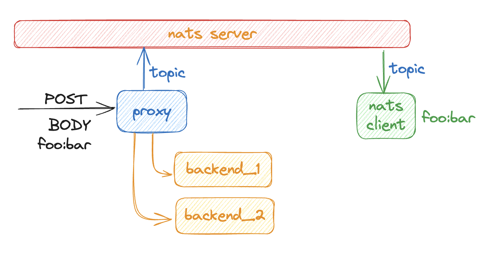

## PRUEBA DE CONCEPTO
## `proxy.go`

The `proxy.go` file contains the main logic for the proxy server. It uses the `net/http/httputil` package to create a reverse proxy and the `nats.go` package to publish messages to a NATS server.



### Key Components

- **`natsConnection` struct**: Holds the NATS connection and topic information.
- **`newProxy` function**: Creates a new HTTP handler function that proxies requests to a specified backend and publishes POST request bodies to a NATS topic.
- **`main` function**: Sets up the NATS connection, defines routes for different backends, and starts the HTTP server.

### Usage

1. **Set up NATS server**: Ensure you have a running NATS server. You can set the NATS server URL using the `NATS_URL` environment variable. If not set, it defaults to `nats://localhost:4222`.

2. **Run the proxy server**:
    ```sh
    go run proxy.go
    ```

3. **Define routes**:
    - Requests to `/mock_1/*` are proxied to `http://localhost:8081`.
    - Requests to `/mock_2/*` are proxied to `http://localhost:8082`.

4. **Publish POST request bodies**: The body of POST requests is published to the NATS topic `example.topic`.

### Example

To test the proxy server, you can use the `request.rest` file with an HTTP client like [REST Client](https://marketplace.visualstudio.com/items?itemName=humao.rest-client) for Visual Studio Code.

```http
POST {{server}}/mock_1/api/v1/echo HTTP/1.1
content-type: application/json

{
    "name": "sample",
    "message": "Mensaje para Nats",
    "time": "Wed, 21 Oct 2015 18:27:50 GMT"
}
